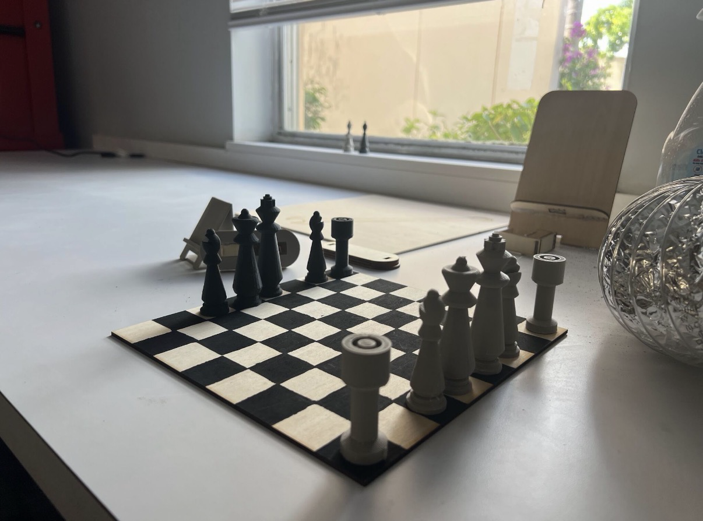

# Chess-Board
Making a chess board with chess pieces

## Project Overview

Designed and manufactured a chess board and chess pieces as a team engineering project. This project focused on applying 3D and 2D design/modeling.

The goal was to create an 8 x 8 inch chess board and a set of chess pieces. My part focused on the King, Queen, Bishop and the board.

## Tools Used

- Autocad
- PrusaSlicer
- 3D Printer

## Chess Pieces

For the chess pieces, I created 
2D profiles and revolved them 360 degrees to create the 3D bodies. 
I also used a consistent design for the base diameters so that they would fit within the board squares.
For the Bishop, I used subtractive modeling to creat the signature opening at the head. For the King and Queen I modified the Bishops body. When printing, I had come across some problems and readjusted the settings on PrusaSlicer to resolve it. I then printed out my pieces twice, one in each color

## Chess Board

The chess board is the 2D Design part of the project. I had to use the laser cutter to make our board the right size (8in x 8in).

## Challenges + Solutions

My first Bishop design had support structures that were difficult to remove. I made the design more simplier and instead of having supports "Everywhere", I had "Enforced Only" on my settings. This allowed me to print successfully while still having my Bishop recognizable.

While revovling my designs, I didn't realize that I needed to use polylines to make the piece into a watertight solid. Without the polylines, it prevented me from exporting my file into a STL.

For the chess board, I initially thought it be a good idea to the engraving method to make our lines and the black squares. It infact did not do that and was engraving the whole board. We changed out approach by just cutting out the board and havingthe pattern hand drawn using paint and tape.

## Project Outcome

The project resulted in a designed and 3D printed Bishop, King, and Queen along with the laser cutted chess board. The overall chess set wasn't completed due to the project timeline.

## Future Improvements

Things I could have improved on was giving myself more time to figure out a way to have the squares engraved on using the laser cutter as it was result in a more clean finsh. I could have just desiged the squares and their placements on AutoCAD, without the extra lines, that way only certain parts would engraved. 

## Final Results

